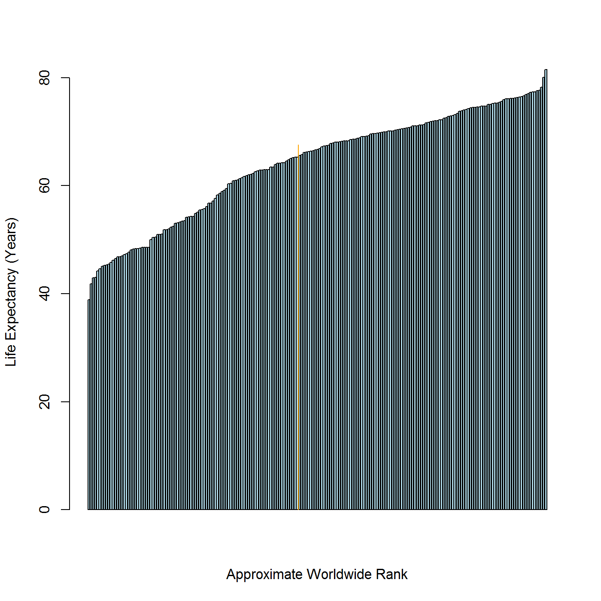

# Predicting Life Expectancy
A simple exercise in data science, predicting Life Expectancy from World Bank Population Health Data

This repository contains the files necessary to reproduce the analysis. For finished products, see:
- http://rpubs.com/delliott79/239502
- http://dtelliott79.shinyapps.io/DevelopingDataProducts-PredictLifeExpectancy/


Predicting Life Expectancy from World Bank Population Health Measures. 
========================================================
author: David T Elliott
date: January 1, 2017
autosize: true

Data Collection
========================================================

Data were obtained from World Bank Health Nutrition and Population Statistics: <http://databank.worldbank.org/data/reports.aspx?source=health-nutrition-and-population-statistics&Type=TABLE&preview=on#advancedDownloadOptions>.

Analysis aimed to:
- Identify an important defining population characteristic (Life Expectancy)
- Identify other population characteristics to be used as predictors (covariables)
- Fit a model to predict Life Expectancy using these covariables
- Use the model to predict Life Expectancy based on user input

Data Pre-processing Code (Compressed)
========================================================
<font size="6">

```r
library(tidyr); library(dplyr); library(plotly); df <- read.csv("Data.csv", header = TRUE)
df <- df %>% gather(key = Year, value = value, 5:60, na.rm = TRUE) %>% rename(Measure = Series.Name, Measure.Code = Series.Code) %>% spread(key = Measure, value = value, fill = NA, drop = TRUE, sep = NULL) %>% select(-Measure.Code, -Country.Code) %>% group_by(Country.Name, Year) %>% summarise_each(funs(sum(., na.rm=TRUE)))
df[df==0] <- NA; df$Year <- gsub("^*X([^.]+).*", "\\1", df$Year); df <- df[!is.na(df$`Life expectancy at birth, total (years)`),]; df <- df[, colMeans(is.na(df)) < .5]; colnames(df)[3] <- "Adol.Fert.Rt"; colnames(df)[4] <- "Age.Dep.Ratio.Old"; colnames(df)[5] <- "Age.Dep.Ratio.Yng"; colnames(df)[6] <- "Birth.Rt"; colnames(df)[7] <- "Fert.Rt"; colnames(df)[8] <- "GNI.US.Dollars"; colnames(df)[9] <- "DPT.Immu"; colnames(df)[10] <- "Measl.Immu"; colnames(df)[11] <- "Pol3.Immu"; colnames(df)[12] <- "Life.Exp"; colnames(df)[13] <- "Pop.Growth"; colnames(df)[14] <- "Perc.Female"; colnames(df)[15] <- "Perc.Male"; colnames(df)[16] <- "Perc.Rural"; colnames(df)[17] <- "Rural.PopGrowth"; colnames(df)[18] <- "Prim.Sch.Perc"; colnames(df)[19] <- "Second.Sch.Perc"; colnames(df)[20] <- "Perc.Urban"; colnames(df)[21] <- "Urban.Pop.Growth"
```
</font>

Model Fit
========================================================
<font size="6">

```
$call
lm(formula = df2$Life.Exp ~ df2$Adol.Fert.Rt + df2$Birth.Rt + 
    df2$Pol3.Immu + df2$Second.Sch.Perc + df2$Urban.Pop.Growth)
```

```
$r.squared
[1] 0.8022235
```

```
$coefficients
                        Estimate  Std. Error    t value      Pr(>|t|)
(Intercept)          69.11382903 0.726720917  95.103674  0.000000e+00
df2$Adol.Fert.Rt     -0.02130148 0.002700452  -7.888115  4.009793e-15
df2$Birth.Rt         -0.42835175 0.015403598 -27.808551 1.115799e-154
df2$Pol3.Immu         0.02600083 0.004804821   5.411404  6.651274e-08
df2$Second.Sch.Perc   0.10317987 0.004569232  22.581446 7.257889e-106
df2$Urban.Pop.Growth  0.58010372 0.050130109  11.571962  1.906093e-30
```
</font>

User Instructions
========================================================
<font size="6">
- Using the sliders, select desired values for given characteristics
- Resulting Life Expectancy prediction is shown by orange bar, overlayed on mean Life Expectancy for each country, similar to the example plot shown below
</font>


